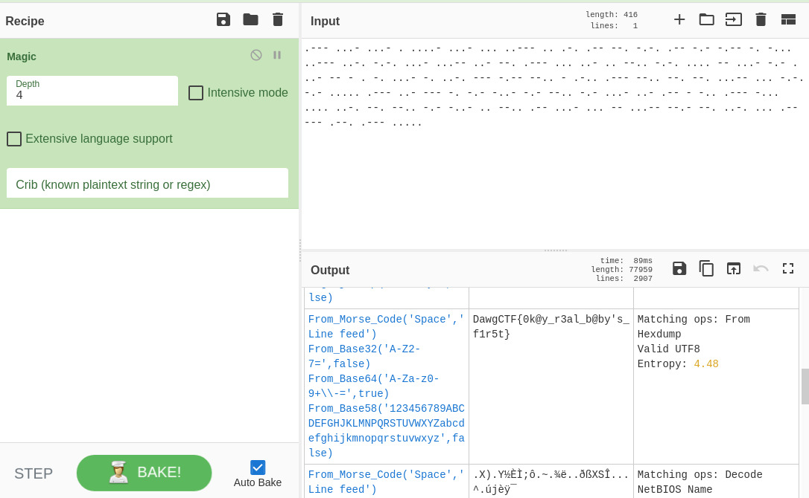

> "The Magic operation attempts to detect various properties of the input data and suggests which operations could help to make more sense of it." - CyberChef

Put the given morse code into [CyberChef](https://gchq.github.io/CyberChef/#recipe=Magic(4,false,false,'')), choose *Magic* operation, depth 3 gave a string still encoded, set depth to 4, the flag shown up.

