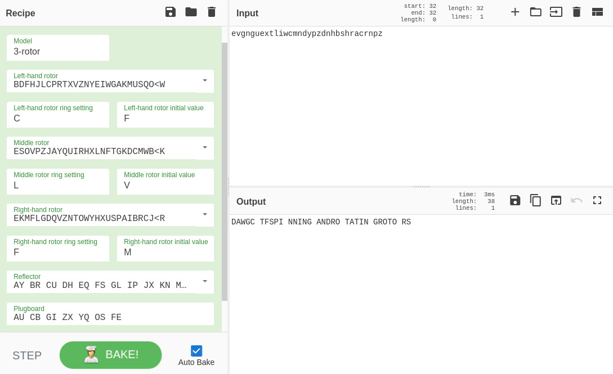

The given cipher file contains the following json data.

```json
{
	"ewfd_sodr": "evgnguextliwcmndypzdnhbshracrnpz",
	"srtosr": {
		"9": "III",
		"x": "IV",
		"b": "I",
		"i8xlec7ro": "B"
	},
	"ix99lnvs": [
		{
			"gebsiqw": "C",
			"ocnqgi": "F"
		},
		{
			"xlbienx": "L",
			"pxksnl": "V"
		},
		{
			"bloiens": "F",
			"lcnoin": "M"
		}
	],
	"ixla_gbafg": {
		"x": "AU",
		"4": "CB",
		"h": "GI",
		"g": "ZX",
		"t": "YQ",
		"z": "OS",
		"m": "FE"
	}
}
```

It's configure for Enigma Machine.

- ``ewfd_sodr`` indicates the encrypted flag.
- In ``srtosr`` are left-hand, middle and right-hand rotor, "B" is reflector.
- In ``ix99lnvs``, are ring setting and initial value for left-hand, middle and right-hand rotor.
- ``ixla_gbafg`` is plugboard. 

Put them into [CyberChef](https://gchq.github.io/CyberChef/#recipe=Enigma('3-rotor','LEYJVCNIXWPBQMDRTAKZGFUHOS','A','A','BDFHJLCPRTXVZNYEIWGAKMUSQO%3CW','C','F','ESOVPZJAYQUIRHXLNFTGKDCMWB%3CK','L','V','EKMFLGDQVZNTOWYHXUSPAIBRCJ%3CR','F','M','AY%20BR%20CU%20DH%20EQ%20FS%20GL%20IP%20JX%20KN%20MO%20TZ%20VW','AU%20CB%20GI%20ZX%20YQ%20OS%20FE',true)&input=ZXZnbmd1ZXh0bGl3Y21uZHlwemRuaGJzaHJhY3JucHo).



Output was *DAWGC TFSPI NNING ANDRO TATIN GROTO RS*, so the flag was *DawgCTF{spinningandrotatingrotors}*.

