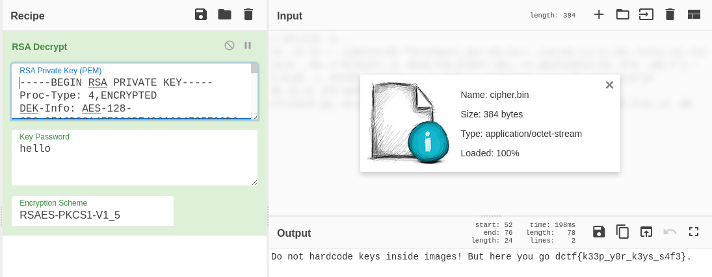

Load *image* file ``docker load < image`` and checked the history. There were something interesting in *history*, *cipher.bin*, *id_rsa*, and a secret key.

```bash
$ docker history ctf-docker-image:latest --no-trunc
IMAGE                                                                     CREATED             CREATED BY                                                                                                                SIZE                COMMENT
sha256:7dabd7d32d701c6380d8e9f053d83d050569b063fbcf7ebc65e69404bed867a5   10 days ago         /bin/sh -c #(nop)  CMD ["cat" "/home/alice/cipher.bin"]                                                                   0B                  
<missing>                                                                 10 days ago         /bin/sh -c #(nop)  USER alice                                                                                             0B                  
<missing>                                                                 10 days ago         /bin/sh -c chmod 600 /home/alice/cipher.bin                                                                               384B                
<missing>                                                                 10 days ago         /bin/sh -c chown alice:alice /home/alice/cipher.bin                                                                       384B                
<missing>                                                                 10 days ago         /bin/sh -c #(nop) COPY file:74c685a989b7fe9e41bbc0b8bdebfd5a7fc9a1c64ac2afbf58a482f005eac558 in /home/alice/cipher.bin    384B                
<missing>                                                                 10 days ago         /bin/sh -c addgroup -S alice && adduser -S alice -G alice                                                                 4.67kB              
<missing>                                                                 10 days ago         /bin/sh -c #(nop)  ENV SECRET_KEY=58703273357638792F423F4528482B4D6251655468566D597133743677397A24                        0B                  
<missing>                                                                 10 days ago         /bin/sh -c #(nop)  ARG SECRET_KEY                                                                                         0B                  
<missing>                                                                 10 days ago         /bin/sh -c chmod 600 /root/.ssh/id_rsa                                                                                    2.63kB              
<missing>                                                                 10 days ago         /bin/sh -c #(nop) COPY file:10b1d5253a9830ea19b3097c68c9d434b3f757225a404deb1c2fefb6ca5d49eb in /root/.ssh/id_rsa         2.63kB              
<missing>                                                                 2 months ago        /bin/sh -c #(nop)  CMD ["/bin/sh"]                                                                                        0B                  
<missing>                                                                 2 months ago        /bin/sh -c #(nop) ADD file:0dbb1cd66f708f54f7e6663eabf24095fcd53747bfb09912a118a77e737d9617 in /                          5.58MB              
```

Untar *image* to get all the layers, used *grep* to find the *cipher.bin* and extract the file from one of the layer included it. Extracted *id_rsa* in the same way.

```bash
$ grep cipher.bin . -R|grep Binary
Binary file ./image matches
Binary file ./98c9cc069e93e9cae98bbe8369566eda72b487e9ca60509e89d9d7ee98071f0d/layer.tar matches
Binary file ./b15241aee72134a1eda317850258161406ae470b813c26a1a244f7645b553014/layer.tar matches
Binary file ./df6e2b0dba838bcc158171c209ae2c7b8aeec4a8638a2fa981abda520233a170/layer.tar matches
```

*id_rsa* is a *OPENSSH PRIVATE KEY*, converted it to *RSA PRIVATE KEY*.

```bash
$ ssh-keygen -p -m PEM -f id_rsa
Enter old passphrase: 
Key has comment 'root@kali'
Enter new passphrase (empty for no passphrase): 
Enter same passphrase again: 
Your identification has been saved with the new passphrase.
```

Decrypted *cipher.bin* in [CyberChef](https://gchq.github.io/CyberChef) to find the flag.

